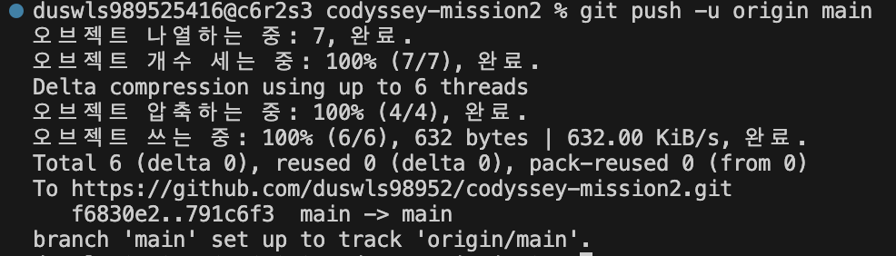
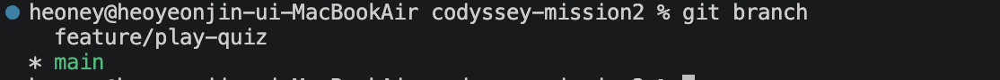
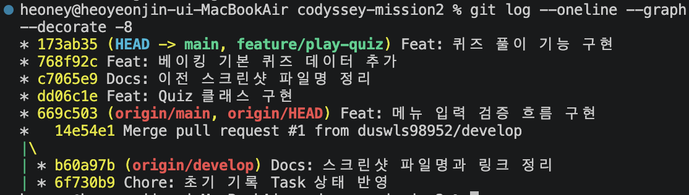

# Development Log

## 1. 초기 개발 환경 및 Git 저장소 설정

관련 요구사항:
- 4-1. Git 저장소 설정
- 7. 제출물: 개발 환경 설정 스크린샷

작업 내용:
- Python 및 Git 버전 확인
- Git 저장소 초기화
- .gitignore, README.md, main.py 생성
- 초기 커밋 생성
- GitHub 원격 저장소 push
- pull 상태 확인

증빙 자료:

### Python 및 Git 버전 확인

### Git 저장소 초기화

### 기본 파일 생성

### 변경 파일 스테이징 및 상태 확인

### 초기 커밋 생성

### GitHub 원격 저장소 push

### pull 상태 확인

## 2. 메뉴 기능 구현

관련 요구사항:
- 4-2. 메뉴 기능
- 4-3. 공통 입력 / 예외 처리 기준 일부

작업 내용:
- 메뉴 출력 로직을 `show_menu()` 함수로 분리
- 메뉴 입력 처리 로직을 `get_menu_choice()` 함수로 분리
- 입력 앞뒤 공백 제거 처리
- 빈 입력, 숫자가 아닌 입력, 허용 범위 밖 숫자 입력 처리
- `KeyboardInterrupt`, `EOFError` 발생 시 안내 메시지 출력 후 안전 종료 처리

검증 내용:
- 빈 입력, 문자 입력, 범위 밖 숫자 입력 후 다시 입력받는 흐름 확인
- `5` 입력 시 프로그램 종료 확인

## 3. Quiz 클래스 구현

관련 요구사항:
- 4-4. Quiz 클래스

작업 내용:
- 개별 퀴즈를 표현하는 `Quiz` 클래스 추가
- 문제 문장, 보기 목록, 정답 번호를 속성으로 저장
- 문제와 보기를 출력하는 `display()` 메서드 추가
- 사용자의 답과 정답을 비교하는 `is_correct()` 메서드 추가

검증 내용:
- `Quiz` 객체 생성 후 문제와 보기 출력 확인
- 정답 번호 비교 결과 확인

## 4. 기본 퀴즈 데이터 작성

관련 요구사항:
- 4-5. 기본 퀴즈 데이터

작업 내용:
- 베이킹 주제의 기본 퀴즈 5개 작성
- 각 퀴즈에 문제, 보기 4개, 정답 번호 포함
- `Quiz` 클래스 인스턴스로 기본 퀴즈 데이터 생성

검증 내용:
- 기본 퀴즈가 5개인지 확인
- 각 퀴즈의 보기가 4개인지 확인
- 각 퀴즈의 정답 번호가 1~4 사이인지 확인

## 5. 퀴즈 풀기 기능 구현

관련 요구사항:
- 4-6. 퀴즈 풀기
- 4-3. 공통 입력 / 예외 처리 기준 일부

작업 내용:
- 정답 번호 입력을 처리하는 `get_answer_choice()` 함수 추가
- 퀴즈 목록을 순서대로 출제하는 `play_quiz()` 함수 추가
- 각 문제의 정답 / 오답 여부 출력
- 모든 문제를 푼 뒤 맞힌 개수 출력
- 퀴즈가 없는 경우 안내 후 메뉴로 돌아가도록 처리
- 메뉴 1번을 기본 퀴즈 풀이 기능과 연결

검증 내용:
- 메뉴 1번 선택 시 기본 퀴즈 5개 출제 확인
- 빈 입력, 문자 입력, 범위 밖 정답 번호 입력 후 재입력 흐름 확인
- 모든 문제 풀이 후 총점 출력 확인

증빙 자료:

### 퀴즈 풀이 기능 브랜치 확인

### 퀴즈 풀이 기능 병합 후 로그 확인

## 6. QuizGame 클래스 기본 구조 정리

관련 요구사항:
- 4-10. QuizGame 클래스 일부

작업 내용:
- 게임 전체를 관리하는 `QuizGame` 클래스 추가
- 퀴즈 목록을 `self.quizzes` 속성으로 저장
- 최고 점수 초기값을 `self.best_score` 속성으로 저장
- 메뉴 실행 흐름을 `QuizGame.run()` 메서드로 이동
- 퀴즈 풀이 기능이 `self.quizzes`를 사용하도록 변경

검증 내용:
- 프로그램 실행 시 기존 메뉴 출력 확인
- 메뉴 1번 선택 시 기본 퀴즈 풀이 기능 유지 확인
- 메뉴 5번 선택 시 정상 종료 확인

## 7. 퀴즈 추가 기능 기본 구현

관련 요구사항:
- 4-7. 퀴즈 추가 일부
- 4-3. 공통 입력 / 예외 처리 기준 일부

작업 내용:
- 빈 문자열 입력을 막는 `get_required_text()` 함수 추가
- `QuizGame.add_quiz()` 메서드 추가
- 문제, 보기 4개, 정답 번호를 입력받아 새 퀴즈 생성
- 생성한 퀴즈를 `self.quizzes` 목록에 추가
- 메뉴 2번을 퀴즈 추가 기능과 연결

검증 내용:
- 메뉴 2번 선택 후 새 퀴즈 입력 확인
- 빈 문제 / 빈 보기 입력 시 재입력 흐름 확인
- 추가한 퀴즈가 같은 실행 중 퀴즈 풀이에 포함되는지 확인

