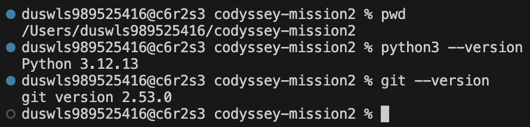
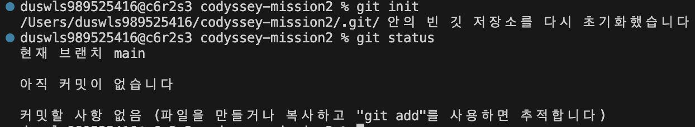
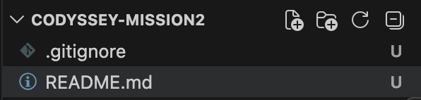
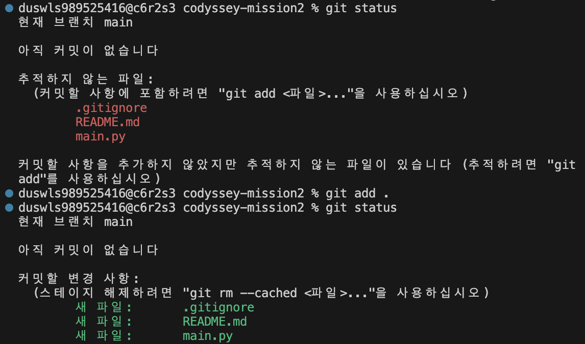
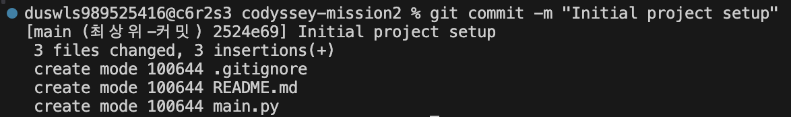
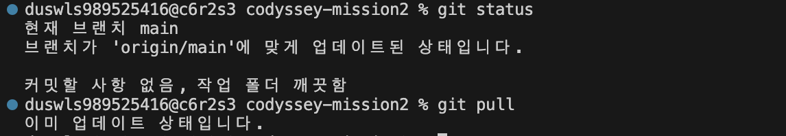

# Development Log

## 1. 초기 개발 환경 및 Git 저장소 설정

관련 요구사항:
- 4-1. Git 저장소 설정
- 7. 제출물: 개발 환경 설정 스크린샷

작업 내용:
- Python 및 Git 버전 확인
- Git 저장소 초기화
- .gitignore, README.md, main.py 생성
- 초기 커밋 생성
- GitHub 원격 저장소 push
- pull 상태 확인

증빙 자료:

### Python 및 Git 버전 확인

### Git 저장소 초기화

### 기본 파일 생성

### 변경 파일 스테이징 및 상태 확인

### 초기 커밋 생성

### GitHub 원격 저장소 push

### pull 상태 확인

